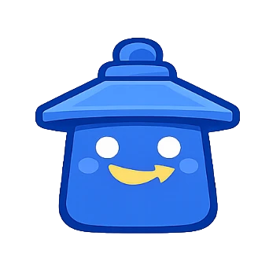
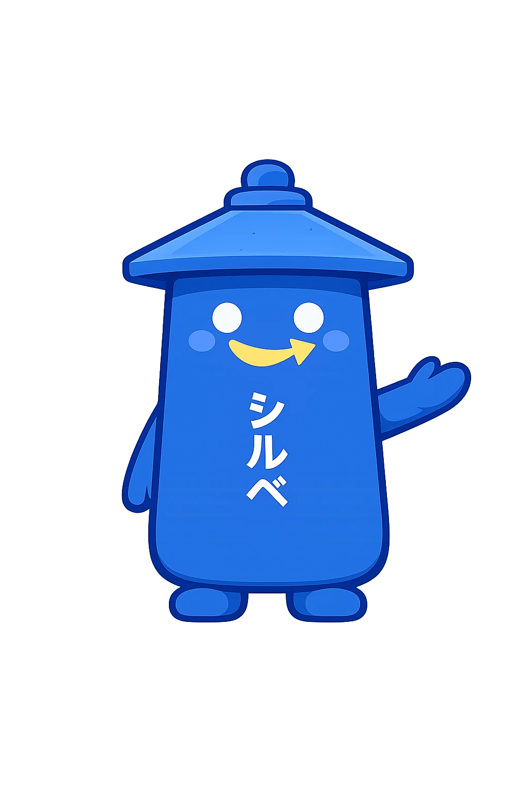

# AIVIBLE — Brand & Mascot Decisions

> Decision log for the Japan Blue Index brand identity and Shirube mascot. Reconstructed from dev journals (`aivible-app/docs/progress/`) and `docs/Branding-Research.md`. Dates are decision dates, not document dates.

---

## Summary (read this first)

| Element | Decision | Date |
|---|---|---|
| Brand direction | Direction A — 「藍」AI Indigo + Seal | 2026-06-13 |
| Logo concept | #2 Japan Blue Index + #5 Ukiyo-e wave mark + #3 mascot | 2026-06-13 (vote) |
| Mascot name | **Shirube (標 / michishirube)** — retired Aivy | 2026-06-15 |
| Mascot style | Flat, no gradient — brick-retirement of the "one gradient" rule | 2026-06-15 |
| Smile treatment | Amazon-style filled gold arc + arrowhead (NOT a stroke arc) | 2026-06-15/18 |
| Mascot rebrand in product | All mockups: Aivy → Shirube (Jun 16). Live React app: WaveLogo → Shirube PNG (Jun 23) | 2026-06-16 |
| Shirube visual redesign | New polished chibi form — pagoda roof, cylindrical body, arms+feet, シルベ text. ChatGPT-generated Jun 22. | 2026-06-23 |
| App logo | `WaveLogo.tsx` now renders `shirube-logo.webp` (11KB) — wave SVG retired from the nav | 2026-06-23 |

---

## 1. Brand research & direction (2026-06-13)

### Problem
The competitive landscape (Lovable, Bolt, v0, Durable, Peraichi) clusters into two worn visual lanes: *AI startup* (purple/pink gradients, sparkles, dark mode, "magic") and *website builder* (editor screenshots, "create your site in seconds"). Neither owns "AI visibility" as a category, and nobody is visually Japanese — even the Japanese tools (STUDIO, Peraichi) dress in Western SaaS clothes.

AIVIBLE's actual claim is *"AI engines can't see you; we make you visible and verifiable."* If the brand looks like Durable or Peraichi, VCs and buyers file it as "another site builder."

### The 藍/AI homophone
藍 (*ai*) = Japanese indigo. AIVIBLE already used indigo-500 (`#6366F1`). The homophone is a strategic asset: **shifting toward true *ai-iro* makes the existing indigo retroactively Japanese**, not just Tailwind. Brand story in 10 seconds: *"藍 means indigo. It's pronounced 'AI.' We make you visible to AI, in Japan's own color."*

### Three directions evaluated

| Direction | Core idea | Verdict |
|---|---|---|
| **A — 「藍」AI Indigo + Seal** | Indigo stays; red ● → hanko certification mark; calm authority; craftsman-certifier | **Chosen** |
| B — のれん Noren / Hospitality | Warm, omotenashi-led; noren curtain motif; lantern | Dropped — warmer but blends into friendly-SME SaaS crowd, weaker category claim |
| C — Visibility Index | Dark kon + gold, data-led, Bloomberg/Moody's of AI visibility | Dropped — strongest VC story but dark-mode inversion = too much work before Jun 25 |

**Direction A wins because** it is the only direction where existing assets are not just compatible but *retroactively meaningful*: the indigo was always 藍, the red dot was always a seal. It's a story of discovery, not pivot.

### Six 藍 brand concepts (voted by team, Jun 13)

A compare page was built at `public/branding/index.html` with live Supabase vote tracking (`branding_votes` table). Six concepts:

| # | Name | Core treatment |
|---|---|---|
| 1 | 藍 Ai-Indigo Seal | kinari background, ai-iro navy, shu seal mark — the research pick |
| **2** | **Japan Blue Index** | Score-as-brand; kon/wave/gold data palette; wave logo mark |
| 3 | キャラクター Aivy Mascot | Indigo mascot spirit carrying the hanko |
| 4 | 昭和レトロ Showa Retro | Kissaten revival; cream/burnt-orange/teal; Reggae One font |
| 5 | 浮世絵 Ukiyo-e Wave | Hokusai Prussian-blue woodblock; "great wave of AI travelers" |
| 6 | 搭乗券 Boarding Pass | Shop "cleared for boarding" onto the AI flight; passport stamp |

**Vote result (4 votes total):** Concept #2 Japan Blue Index won 3 first-choice votes (Ely, Cherprang, Jin). Concept #3 Mascot was the leading second-choice.

**Ely's comment:** *"I like the blue colors. I also like the mascot idea. Need to verify from a Japanese perspective though."*

### Adopted synthesis

- **Identity:** #2 Japan Blue Index (score-as-brand, verification focus)
- **Logo mark:** #5 Ukiyo-e wave (the simplified wave SVG)
- **In-product mascot:** #3 (mascot concept, further developed → Shirube)

---

## 2. Color tokens

The brand palette uses traditional Japanese color vocabulary (*dentōshoku*):

| Token | Hex | Japanese name | Role |
|---|---|---|---|
| `--kon` | `#18243F` | 紺 *kon* (deep indigo) | Primary navy — body text, major shapes |
| `--kon-2` | `#223A70` | 藍 *ai-iro* variant | Secondary navy — UI elements, storefronts |
| `--wave` | `#1F4788` | Prussian blue | Wave arcs, seigaiha, large BG shapes |
| `--gold` | `#C8A859` | 金 *kin* | Score arc, Shirube's arrow/smile, verified gem badge — **one element per illustration max** |
| `--sun` | `#D6452C` | 朱 *shu* (vermilion) | Logo disc, map pins, hanko seal — **mark only, never decorative** |
| `--paper` | `#F5EEDC` | 生成り *kinari* (unbleached cloth) | Background; warm, not clinical white |

**No gradient anywhere in the brand.** This was formally decided on 2026-06-15 when the mascot was redesigned (see §4). The previous "one gradient exception for the mascot" rule was retired.

---

## 3. Brand personality & voice

**Personality:** Calm authority. A craftsman-certifier, not a magician. "Quietly certain."

**What to avoid:** gradients, ✨ sparkles, "magic" copy ("magically generate…"), AI startup clichés (purple/pink aurora, dark mode hero, orb animations). The brand certifies; it doesn't conjure.

**Assistant voice (omotenashi register):**
- Warm-formal Japanese (です/ます, light 敬語)
- Presents options, confirms with a stamp moment
- "I've prepared three options for your storefront" — not "Generated 3 variants ✨"
- Never robotic, never chatty

**Tagline:** EN: *"Be seen by AI. Verified in indigo."* / JP: 「AIに、見つけてもらう。」

**The seal as product feature:** the "AI-Verified" hanko badge on every generated storefront is both a brand element and a distribution surface — every storefront carries the mark, like "Made with Lovable" but with cultural weight.

---

## 4. Mascot history — from Aivy to Shirube

### 4.1 Aivy (retired 2026-06-15)

The original mascot concept was **"Aivy"** — an indigo gradient droplet/blob, derived from the LINE bot persona of the same name, using `--aivy-1 #6E80E0` → `--aivy-2 #4A5DC4` gradient fills.

**Retired for two reasons:**

1. **Collision risk:** the blue water-drop is already an established yuru-chara archetype. Five municipalities already own blue-water mascots (Mizurin, Mikoro, Kure-shi, etc.) — Aivy sat too close.
2. **Off-brand:** a glossy big-eyed gradient blob reads "Lovable / consumer toy." Direction A's brand is a *craftsman-certifier* — calm authority. A cute blob contradicts that.

The gradient on Aivy also meant the brand carried a gradient exception, which diluted the no-gradient rule.

### 4.2 Mascot research (2026-06-15)

A formal two-risk check was run on mascot candidates:
- **Direct character-collision** (does any other mascot own this archetype?)
- **Motif overexposure** (is this a tourist-Japan cliché?)

**Candidates rejected:**

| Candidate | Rejection reason |
|---|---|
| Lantern (Akari concept) | Clears character-collision but red chōchin = izakaya industry cliché — the SME customers' own brand |
| Tanuki, Kitsune, crane | Overexposed folklore mascots; collision risk |
| Blue water-drop (Aivy) | Direct collision with yuru-chara archetypes; off-brand tone |

### 4.3 Shirube chosen (2026-06-15)

**Shirube (標 / michishirube — Japanese stone guidepost)** cleared both checks:
- No existing mascot owns the stone-guidepost archetype
- Not an industry cliché (it's infrastructure, not a souvenir motif)
- Dead-on strategically: wayfinding / "being found" + omotenashi ("let me show you the way")

**Why it works for the brand:**
- A michishirube is a marker that tells travelers where to go — exactly what AIVIBLE does for businesses (make them findable)
- The gold "this way" arrow on the body doubles as the smile, connecting personality to function
- Flat, stone, calm = the craftsman-certifier tone, not a cute consumer blob

### 4.4 Shirube construction spec

```
Body:    Rounded-corner vertical rectangle — kon navy (#18243F or #223A70)
         Proportioned like a calm standing figure (taller than wide)
Arms:    Two short minimal arms, small rounded hands
Eyes:    Two white dot eyes
Smile:   Amazon-style gold filled arc + arrowhead (see §4.5)
Arrow:   Separate fixed gold "this way" arrow on chest — his identity emblem
Text:    Vertical こちらへ (kochirae) down the face in white/cream
Seal:    Small red square hanko near base, white 藍 (ai) kanji inside
```

**Persona:**
- Calm and certain — never surprised, never flailing
- Gestures: pointing (one hand extended) or presenting (both hands open, palms up)
- Omotenashi spirit — guiding, inviting, never selling
- No sparkles, no magic effects, no wide-eyed kawaii expression

### 4.5 The smile — Amazon-style filled arc (decided 2026-06-15, fixed 2026-06-18)

**The correct smile is a filled gold arc + arrowhead**, not a stroke arc.

The "Amazon smile" reference: like the Amazon logo's subtle upward arrow-curve — confident, understated, reading as direction rather than expression. It fits Shirube because his entire body is about pointing the way; the smile is another arrow.

**Correct SVG paths (from canonical `_shirube-character.svg`):**
```svg
<!-- curved smile body — filled gold wedge -->
<path d="M54 125 Q67 136 79 126.5 Q67 128 54 125 Z" fill="#FFC94F"/>
<!-- arrowhead — the "dimple" that makes it an arrow -->
<path d="M80 124 L85.5 126.6 L81.5 130 Z" fill="#FFC94F"/>
```

**What NOT to use:**
```svg
<!-- WRONG — stroke arc, reads as plain smile not Amazon-style -->
<path d="M17.5 21.8 Q22 25.2 26.5 21.8" stroke="#fff" stroke-width="1.6" fill="none"/>
```

**History:** The memory note from Jun 15–16 said the SVGs used the "wrong smile" and needed revision. On audit (Jun 18), the canonical character SVG and all 11 scene SVGs were already using the correct filled gold arrow. The only file with the wrong stroke arc was `public/mockups/sme-journey/icons/shirube.svg` — fixed in commit `603edb0` (Jun 18, PR #2 branch `feat/mockup-flows`).

**The `no-results.svg` intentional frown:** that SVG uses `stroke="#FFC94F" fill="none"` frown arc deliberately — Shirube is in a "worried" emotional state for the empty-search screen. This is not a bug; it's a character state variation.

### 4.7 Visual redesign — new polished character form (2026-06-23)

The flat guidepost design was replaced with a more polished chibi character, generated via ChatGPT Image (Jun 22 evening).

**New design:**
- **Hat/roof:** Wide pagoda-style roof with small knob finial on top — reads "Japanese lantern / signpost" not "chōchin" because it's blue, not red
- **Body:** Cylindrical/trapezoidal blue body (brighter Aivible blue, not the deep kon navy)
- **Eyes:** Two large white circular eyes
- **Smile:** Yellow arrow-curve smile retained (Amazon-style arc + arrowhead — §4.5 decision unchanged)
- **Arms:** Short rounded arms (one waving in the full-body version)
- **Feet:** Two small round feet
- **Full-body variant:** "シルベ" vertical katakana text on body, glowing dark background — for hero/marketing use

**Two production assets (source: `~/Downloads/`):**
| File | Use |
|---|---|
| `shirube-small-logo.png` → `public/shirube-logo.webp` (11KB) | Nav icon, chat avatar, favicon |
| `shirube-big.png` → `docs/shirube-character-full.webp` (132KB) | Marketing hero, pitch deck |

**Icon (nav / avatar):**



**Full character:**



**Applied:**
- All 20 `ai-audit/public/mockups/traveler-journey/*.html` updated to `icons/shirube-new.webp`
- `WaveLogo.tsx` updated to `<Image src="/shirube-logo.webp">` (see §5)

**Open:** Vectorize to SVG for production use (the PNG works for now; SVGs need refinement before replacing).

### 4.6 Rebrand rollout (2026-06-16)

"Aivy" → "Shirube" (EN) / "アイビー" → "シルベ" (JP) was applied across all HTML mockups on Jun 16. The live React app still says "Aivy" as of Jun 16 — pending a separate pass.

The chat avatar `✨`/`🧭` emoji was replaced with a hand-authored `shirube.svg` (flat navy guidepost, gold arrow, dot eyes, smile, 藍 seal on a washi-cream circle).

---

## 5. Logo system

### The wave mark

A simplified Hokusai-wave SVG (concept #5): three wave arcs in navy/wave blue with white foam dots, a red sun disc (the 藍/AI homophone visual), framed in a rounded-corner square at `#F5EEDC` kinari background.

**Status as of Jun 23:** The wave mark remains the abstract brand logo mark, but the nav icon in the live React app has been replaced by the Shirube character PNG (see §4.7). The wave SVG is still used in the mockup hubs and as the conceptual brand mark in decks.

**Canonical SVG** (the `<svg width="26" height="26">` from the mockup hub header):
```svg
<rect width="32" height="32" rx="8" fill="#F5EEDC"/>
<circle cx="22.5" cy="9.5" r="4.3" fill="#D6452C"/>
<path d="M0 23 C5.5 16 10.5 27 16 21.5 C21 16.5 26.5 25 32 19.5 L32 32 L0 32 Z" fill="#1F4788"/>
<circle cx="8.5" cy="23" r="1.25" fill="#fff"/>
<circle cx="17.5" cy="25" r="1" fill="#fff"/>
<circle cx="25.5" cy="24" r="1" fill="#fff"/>
```

### The seal

The red ● mark is a hanko-derived certification device. Usage rules:
- Reserved for the mark + "AI-Verified" badge on storefronts
- Never used as a decorative red element
- On generated storefronts it functions as a distribution surface ("AI VISIBLE ✓") — the product feature that makes the brand visible

---

## 6. Illustration system

See [`docs/ILLUSTRATION-SYSTEM.md`](ILLUSTRATION-SYSTEM.md) for the full illustration spec, scene inventory, SVG audit results, and generation workflow.

**Key rule:** flat solid fills only, zero gradients, zero heavy outlines. The same visual language as the logo mark and the flat shadcn UI.

---

## 7. Typography

| Role | Font | Why |
|---|---|---|
| EN body + UI | Inter | Neutral, already in use, correct for dense product UI |
| JP marketing | Zen Kaku Gothic New | Warmer, slightly humanist — matches omotenashi tone |
| JP display accents | Shippori Mincho | One serif headline over whitespace instantly reads "considered Japanese" |

Rule: Mincho only where you'd use italics in English (short display moments, not body text).

---

## 8. What was deliberately rejected

| Element | Why rejected |
|---|---|
| Gradients | Direction A brand; adds consumer-toy / AI-startup read |
| ✨ Sparkles / "magic" copy | "Magically generate" = the §2 AI cliché. A seal certifies; it doesn't conjure |
| Dark mode hero | Signals developer tool, wrong for ryokan owners and intimidating |
| Geisha / samurai / ninja | Cultural stereotypes; the brand targets regional inn owners, not tourists |
| Cherry-blossom overload | Tourist-Japan cliché; the illustrations use 1–2 calm motifs max |
| Torii gates / Mt. Fuji silhouette | Overused; replaced with noren, seigaiha, guidepost |
| Aivy droplet gradient | Character-collision risk + off-brand consumer tone |
| Stroke-arc smile on Shirube | Reads as plain cheerful smile; the gold filled arc reads as calm direction |
| Swiss / "International Typographic" look | Dropped in branding round 2 — Linear/Vercel already own it, no differentiation |
